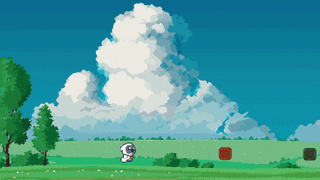

# **Endless Runner Unity Game** 🚀

[](./LICENSE)  
[](https://unity.com/releases)

## 🎮 **Demo**



Watch the gameplay in action! (Click the image above for a GIF of the game.)

---

## 📖 **Overview**

This project is an **Endless Runner** game developed in **Unity** 2022.3.47f1. The gameplay involves core mechanics like **infinite platform generation**, **jumping mechanics**, and **dynamic camera control**. Designed for both **mobile** and **desktop** platforms, this project allows for a hands-on exploration of **game development** and is a solid base for more advanced projects.

---

## 🚩 **Key Features**

- **Infinite Platform Generation**: The game dynamically generates platforms as the player moves forward.
- **Jumping Mechanics**: Press **spacebar** to jump. The mechanics are responsive and intuitive.
- **Restart Functionality**: Press **R** to quickly restart the game.
- **Cinemachine Camera Control**: The camera smoothly tracks the player's movements, keeping the character in view.
- **Parallax Background**: The game features a scrolling background to enhance depth and visual appeal.
- **GitHub Integration for Source Code Management**: The project is managed with **GitHub**, including **Git LFS** to handle large files.

---

## 🛠️ **Setup Instructions**

### **Prerequisites**

- **Unity Version**: `2022.3.47f1` or newer.
- **Platform Support**: Configured for **Windows**, **Mac**, **WebGL**, and adaptable for mobile platforms.

### **Installation**

1.  **Clone the repository**:

    ```bash
    git clone https://github.com/olitreadwell/unity-project-starter-template.git
    cd unity-project-starter-template
    ```

2.  **Open the project in Unity**:

    - Open **Unity Hub**.
    - Click **Open** and navigate to the project folder you cloned.

3.  **Install dependencies**:

    - Unity will prompt you to install any missing packages, such as **Cinemachine**, **Input System**, etc.

4.  **Build & Run**:

    - Go to **File > Build and Run** and choose your platform (Windows, Mac, WebGL).

---

## 🎮 **Gameplay Instructions**

- **Jump**: Press **Spacebar** to jump.
- **Restart**: Press **R** to restart the game.

_Note: Additional gameplay controls will be added in future updates._

---

## 📂 **Project Structure**

The project is structured into various game objects and matching folders to ensure ease of access and maintain scalability.

```plaintext
├── Assets/
│   ├── Scripts/               # C# scripts for game mechanics and management
│   ├── Prefabs/               # Prefabricated game objects (Player, Platforms, PowerUps)
│   ├── Scenes/                # Game scenes like MainScene
│   ├── UI/                    # Placeholder for future UI components (e.g., score, lives, menus)
├── ProjectSettings/           # Unity-specific project settings and configurations
├── Packages/                  # Unity packages such as Cinemachine, Input System
└── README.md                  # This file
```

### **Hierarchy Structure**

- **Cameras**:

  - `Main Camera`: The primary camera for rendering the game.
  - `Cinemachine Virtual Camera`: Tracks and follows the player character.

- **Player**:

  - `PlayerCharacter`: The player-controlled object.
  - `GroundCheck`: Used to detect whether the player is grounded to enable jumping.

- **Environment**:

  - `Parallax Background`: Contains background layers (e.g., **Ground**, **Sky**, **Clouds**, etc.) for the parallax effect.

- **Gameplay Elements** (In Progress):

  - `PowerUps`: Placeholder for power-up objects to boost the player.
  - `PowerDowns`: Placeholder for power-down objects that will debuff the player.
  - `Enemies`: Placeholder for enemies that the player will encounter.

- **Managers**:

  - `GameManager`: Manages the game state (e.g., pause, restart).
  - `AudioManager`: Placeholder for managing audio in the game.
  - `DebugManager`: Tools and utilities for debugging and testing during development.

- **UI** (In Progress):

  - `ScoreText`: Displays the player’s score (to be implemented).
  - `LivesText`: Displays remaining lives (to be implemented).
  - `GameOverScreen`: Placeholder for the game-over screen.
  - `PauseMenu`: Placeholder for the pause menu.

---

## **Development Challenges**

### **1\. Layer and Tag Organization**

To manage complexity, I organized objects using **tags**, **sorting layers**, and **parent game objects**. This early organization helped streamline interactions and allowed me to easily manage different game elements. Each element is assigned to specific layers, such as **UI**, **Background**, and **Gameplay**, to keep functionality clear and accessible.

### **2\. Infinite Platform Generation and Optimization**

Initially, platforms were being generated too frequently, causing issues like platform duplication and performance drops. After adjusting the platform spacing and checking for platforms that were no longer in view, I improved the game's performance. While I started using **object pooling**, I opted not to continue with it in the current version but may revisit it for further optimization.

### **3\. Parallax Background Design**

The parallax background features multiple layers that scroll at different speeds to create depth and make the game more visually engaging. This was achieved using separate layers for elements like the **sky**, **ground**, and **foreground**.

---

## **Next Steps / Improvements**

1.  **UI**: Implement lives, and game-over screens to improve feedback to the player.
2.  **Increase Difficulty**: The game should gradually become more challenging as the player progresses.
3.  **Random Generation**: Introduce randomized obstacles.
4.  **Health/Lives**: Implement a system for tracking the player’s lives.
5.  **Audio**: Add sound effects for player actions and environment.
6.  **Double Jump**: Add the ability for the player to perform a double jump for added gameplay depth.
7.  **Mobile Controls**: Implement touch controls for mobile devices.

---

## 📝 **License**

This project is licensed under the **Mozilla Public License 2.0**. See the [LICENSE](./LICENSE) file for details.

---

## 🛠️ **Contributing**

Contributions are welcome! To contribute:

1.  **Fork the repository**.
2.  **Create a feature branch**:

    ```bash
    git checkout -b feature/my-new-feature
    ```

3.  **Commit your changes**:

    ```bash
    git commit -m "Add new feature"
    ```

4.  **Push to your branch**:

    ```bash
    git push origin feature/my-new-feature
    ```

5.  **Open a pull request** for review.
